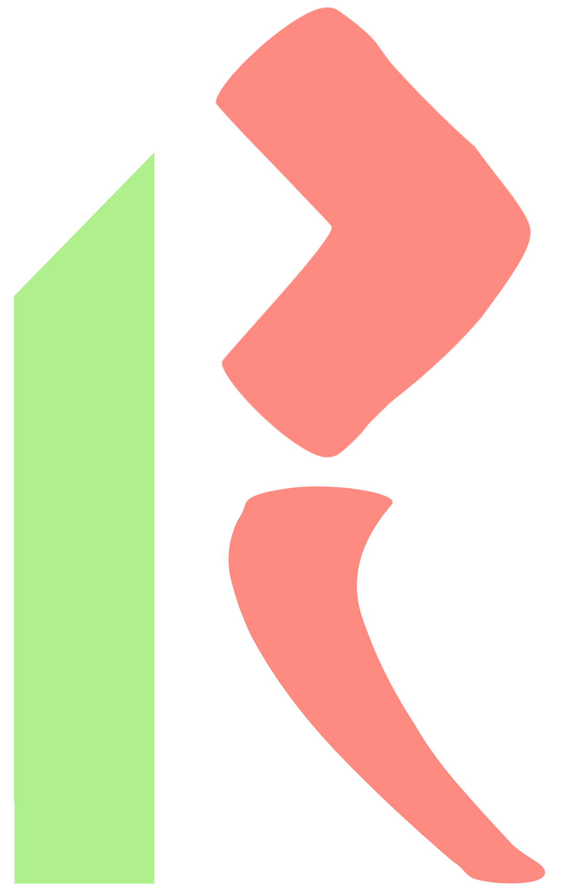
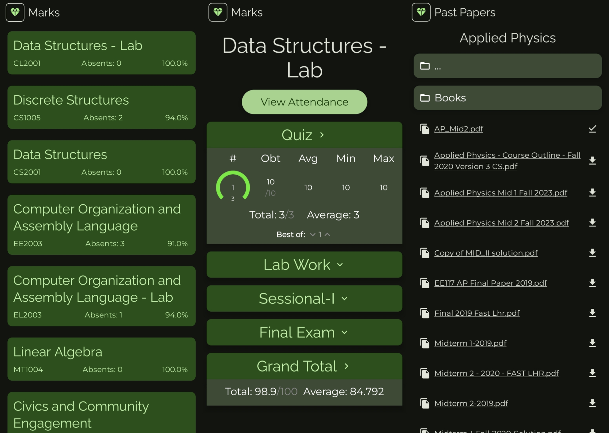

## agraa

Ragraa is a frontend third-party client for [Flex](https://flexstudent.nu.edu.pk/Login), made solely for the purpose of optimizing the user experience on Android.

## Features

* Log into flex with minimal input; only a single captcha.
* Caches data for offline usage and future reference.
*  Convey the marks and attendance through clean and easy to read UI
* Highlight when there has been a change in your marks (after a refresh).
* Option to hide profile picture for whatever reasons you may have
* GPA Calculator to ease your suffering near the end of the semester. (calculates GPA based on MCA
  for relative subjects, so the actual grade may vary)
*  View, download and share past papers which are kept upto date with the wonderful people over from [here](https://github.com/saleha-muzammil/Academic-Time-Machine/)
* Display the transcript

        
## Instructions

Since the app doesn't have access to Flex API, it cannot login without having solved the recaptcha. So you must refresh (which just logs you in again) and solve the captcha that pops up to update your marks/attendance. Also, you have to choose the current semester (only once though, it remembers!) in the login screen.

## Screenshots

## Releases

[Latest release](https://github.com/avexxx3/Ragraa/releases/latest)

## Built upon

- [Kotlin](https://kotlinlang.org/)
- [Compose](https://developer.android.com/develop/ui/compose): a modern UI framework for Kotlin
- [OkHttp](https://github.com/square/okhttp/): HTTP client
- [ObjectBox](https://github.com/objectbox/objectbox-java): SQL Library
- [Jsoup](https://github.com/jhy/jsoup): HTML parser
- [MVIKotlin](https://github.com/arkivanov/MVIKotlin/): Model-View-Intent Architecture.
- [Material 3](https://m3.material.io/components): Material 3 components.
- [GSON](https://github.com/google/gson): JSON Deserializer.

## License

    Copyright 2015 Javier Tomás

    Licensed under the Apache License, Version 2.0 (the "License");
    you may not use this file except in compliance with the License.
    You may obtain a copy of the License at

    http://www.apache.org/licenses/LICENSE-2.0

    Unless required by applicable law or agreed to in writing, software
    distributed under the License is distributed on an "AS IS" BASIS,
    WITHOUT WARRANTIES OR CONDITIONS OF ANY KIND, either express or implied.
    See the License for the specific language governing permissions and
    limitations under the License.

## Disclaimer

    The developer of this application does not have any affiliation with the content providers available.
